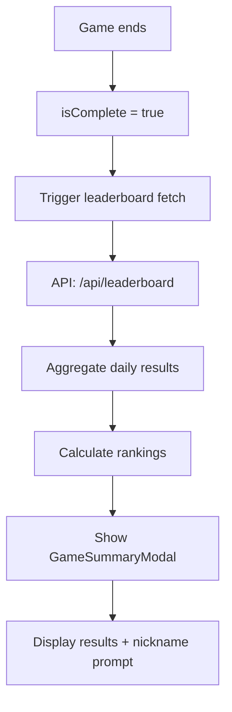
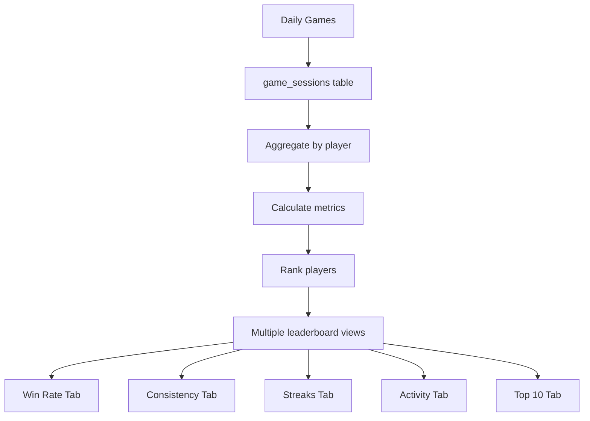

# Leaderboard System Redesign Proposal
*Created: July 2, 2025*
*Updated: July 2, 2025 - Added Critical Bug Analysis & Game Data Flow Documentation*

## 🚨 CRITICAL BUG DISCOVERED

### **Issue**: Incorrect Leaderboard Modal Display
**Problem**: The GameSummaryModal shows "Today you didn't rank - Better luck tomorrow!" when a player hasn't even played yet (e.g., on page refresh).

**Root Cause Analysis**:
1. **Location**: `client/src/App.tsx` lines 78-85
2. **Trigger Logic**: 
   ```typescript
   useEffect(() => {
     if (gameState.isComplete) {
       if (timerRef.current) clearInterval(timerRef.current);
       summaryTimeoutRef.current = setTimeout(() => {
         setShowSummary(true);  // ❌ SHOWS MODAL
         setCanReopenSummary(false);
       }, 5000);
       return;
     }
   }, [gameState.isComplete, gameStarted]);
   ```

3. **Problem**: `gameState.isComplete` is `true` from localStorage even when no actual game has been played in current session
4. **Impact**: Modal appears immediately on page load/refresh showing incorrect "didn't rank" message

### **Fix Required**:
```typescript
// BEFORE (Broken)
if (gameState.isComplete) {
  // Shows modal even if no game played this session
}

// AFTER (Fixed)
if (gameState.isComplete && gameStarted) {
  // Only show modal if game was actually played this session
}
```

**Implementation Priority**: **IMMEDIATE** - This confuses users and makes the app appear broken

---

## 🎯 Executive Summary

The current leaderboard system has several critical issues that need addressing:
1. **🚨 CRITICAL BUG**: Leaderboard modal shows incorrectly when no game played
2. **Streak tracking is broken** - Players' streaks are resetting incorrectly  
3. **Redundant metrics** - Win Rate and Consistency tabs show similar data to Activity/Top 10
4. **Inconsistent data** - Different tabs show conflicting information
5. **Poor user experience** - Confusing navigation between similar metrics

## 📊 Game Data Tracking Flow Documentation

### **Complete Data Flow: Game Logic → Database → Leaderboards**

#### **1. Game Initiation Flow**
```mermaid
graph TD
    A[User clicks Ready] --> B[startNewGame()]
    B --> C[API: /api/word]
    C --> D[GameService.startNewGame()]
    D --> E[Create GameSessionState]
    E --> F[localStorage save]
    F --> G[Game UI Updates]
```

**Key Components**:
- **Frontend**: `client/src/services/GameService.ts`
- **API**: `pages/api/word.ts`
- **Storage**: localStorage + Supabase `game_sessions` table
- **State**: `GameSessionState` interface

#### **2. Guess Submission Flow**
```mermaid
graph TD
    A[User submits guess] --> B[submitGuess()]
    B --> C[API: /api/guess]
    C --> D[Database Operations]
    D --> E[Update game_sessions]
    E --> F[Update player_streaks]
    F --> G[Calculate scores]
    G --> H[Return GuessResponse]
    H --> I[Update UI state]
```

**Database Tables Involved**:
- `game_sessions` - Individual game records
- `player_streaks` - Current/best streaks  
- `players` - Player information
- `words` - Word definitions and clues

#### **3. Game Completion Flow**


#### **4. Leaderboard Data Compilation**


### **Key Database Schema**

#### **game_sessions Table**
```sql
CREATE TABLE game_sessions (
  id UUID PRIMARY KEY,
  player_id UUID REFERENCES players(id),
  word_id UUID REFERENCES words(id),
  is_won BOOLEAN,
  guesses_used INTEGER,
  time_taken INTEGER, -- seconds
  score INTEGER,
  created_at TIMESTAMP,
  -- Theme-related fields
  theme_guess TEXT,
  theme_guess_correct BOOLEAN
);
```

#### **player_streaks Table**
```sql
CREATE TABLE player_streaks (
  player_id UUID PRIMARY KEY REFERENCES players(id),
  current_streak INTEGER DEFAULT 0,
  best_streak INTEGER DEFAULT 0,
  last_win_date DATE,
  updated_at TIMESTAMP
);
```

#### **Leaderboard Calculation Logic**
```sql
-- Daily leaderboard query example
SELECT 
  p.nickname,
  gs.time_taken,
  gs.guesses_used,
  gs.score,
  ROW_NUMBER() OVER (ORDER BY gs.score DESC, gs.time_taken ASC) as rank
FROM game_sessions gs
JOIN players p ON gs.player_id = p.id
WHERE DATE(gs.created_at) = CURRENT_DATE
  AND gs.is_won = true
ORDER BY rank;
```

### **Current Issues in Data Flow**

1. **Streak Calculation Bug**: 
   - Logic in `player_streaks` update triggers may be flawed
   - Beth's streak showing as 1 despite extensive play history

2. **Game State Persistence Issue**:
   - `gameState.isComplete` persists in localStorage
   - Causes modal to show on page refresh without actual gameplay

3. **Inconsistent Ranking Logic**:
   - Different tabs use different sorting/ranking algorithms
   - Win rate calculations may not match between views

## 🔍 Current Issues Analysis

### 1. Streak Tracking Problems
**Issue**: Beth should have a much longer streak but shows as "Current: 1"
- **Root Cause**: Streak calculation logic may be flawed in database triggers
- **Impact**: Demotivates consistent players
- **Evidence**: Screenshots show Beth with extensive activity but streak=1

### 2. Redundant Leaderboard Tabs
**Current Tabs:**
- 🏆 **Win Rate** - Shows win percentage (redundant)
- 🎯 **Consistency** - Shows consistency metrics (unclear purpose)
- 🔥 **Streaks** - Shows current/best streaks (useful)
- 📊 **Activity** - Shows games played + win rate (duplicates Win Rate)
- 🏅 **Top 10** - Shows top 10 players (useful)

**Problems:**
- Win Rate tab duplicates Activity tab's win rate column
- Consistency tab purpose is unclear vs other metrics
- Too many tabs create confusion

### 3. Data Inconsistencies
**Observed Issues:**
- Different tabs show different player rankings
- Win rates may not match between tabs
- Activity counts don't align with streak data

## 🎨 Proposed Solution: Simplified 3-Tab System

### **Tab 1: 🏆 Champions** (Replaces Win Rate + Top 10)
**Purpose**: Show the best performing players
**Metrics**: 
- Overall ranking by score/performance
- Win rate percentage
- Total games played
- Best streak achieved

**Sorting**: By overall performance score (combination of win rate, consistency, and activity)

### **Tab 2: 🔥 Streaks** (Keep existing)
**Purpose**: Show current and best streaks
**Metrics**:
- Current streak
- Best streak ever
- Last played date
- Streak status (active/broken)

**Sorting**: By current streak (descending)

### **Tab 3: 📊 Activity** (Enhanced version)
**Purpose**: Show who's most active and engaged
**Metrics**:
- Total games played
- Games this week
- Last played date
- Win rate (secondary metric)

**Sorting**: By total games played (descending)

## 🔧 Technical Implementation Plan

### Phase 0: Critical Bug Fixes (IMMEDIATE)
1. **Fix GameSummaryModal trigger logic**
   ```typescript
   // In App.tsx, line 78
   if (gameState.isComplete && gameStarted) {
     // Only show modal if game was actually played this session
   }
   ```

2. **Add game session validation**
   - Ensure modal only shows after actual gameplay
   - Clear stale localStorage data appropriately

### Phase 1: Fix Streak Tracking
1. **Audit streak calculation logic**
   - Review `player_streaks` table
   - Check streak update triggers
   - Verify date calculations

2. **Implement proper streak tracking**
   ```sql
   -- Example: Fix streak calculation
   UPDATE player_streaks 
   SET current_streak = (
     SELECT COUNT(*) FROM consecutive_wins 
     WHERE player_id = player_streaks.player_id
   );
   ```

3. **Add streak debugging endpoints**
   - `/api/debug/streak/{playerId}` 
   - Show streak history and calculations

### Phase 2: Redesign Leaderboard Components
1. **Create new leaderboard structure**
   ```typescript
   interface LeaderboardTab {
     id: 'champions' | 'streaks' | 'activity';
     name: string;
     icon: string;
     columns: LeaderboardColumn[];
   }
   ```

2. **Implement unified data fetching**
   - Single API endpoint: `/api/leaderboard/unified`
   - Returns all data needed for all tabs
   - Reduces API calls and ensures consistency

3. **Update UI components**
   - Simplify tab navigation
   - Consistent styling across tabs
   - Clear metric explanations

### Phase 3: Data Consistency Fixes
1. **Create unified player stats view**
   ```sql
   CREATE VIEW unified_player_stats AS
   SELECT 
     p.id,
     p.nickname,
     COUNT(gs.id) as total_games,
     COUNT(CASE WHEN gs.is_won THEN 1 END) as games_won,
     ROUND(COUNT(CASE WHEN gs.is_won THEN 1 END)::float / COUNT(gs.id) * 100, 1) as win_rate,
     ps.current_streak,
     ps.best_streak,
     MAX(gs.created_at) as last_played
   FROM players p
   LEFT JOIN game_sessions gs ON p.id = gs.player_id
   LEFT JOIN player_streaks ps ON p.id = ps.player_id
   GROUP BY p.id, p.nickname, ps.current_streak, ps.best_streak;
   ```

2. **Add data validation checks**
   - Automated tests for streak calculations
   - Consistency checks between tables
   - Alert system for data anomalies

## 📊 Success Metrics

### Before (Current Issues)
- ❌ Critical modal bug confusing users
- ❌ Streak tracking broken
- ❌ 5 confusing tabs
- ❌ Inconsistent data
- ❌ Poor user experience

### After (Target Goals)
- ✅ Modal only shows after actual gameplay
- ✅ Accurate streak tracking
- ✅ 3 clear, purposeful tabs
- ✅ Consistent data across all views
- ✅ Intuitive user experience
- ✅ Fast loading times

## 🚀 Implementation Timeline

### Week 1: Critical Fixes
- [ ] **IMMEDIATE**: Fix GameSummaryModal trigger bug
- [ ] Audit current streak tracking logic
- [ ] Fix Beth's streak and other broken streaks
- [ ] Create debugging tools

### Week 2: Backend Redesign
- [ ] Create unified leaderboard API
- [ ] Implement new data views
- [ ] Add consistency validation

### Week 3: Frontend Redesign
- [ ] Redesign leaderboard components
- [ ] Implement 3-tab system
- [ ] Update UI/UX

### Week 4: Testing & Polish
- [ ] Comprehensive testing
- [ ] Performance optimization
- [ ] User acceptance testing

## 🎯 Next Steps

1. **IMMEDIATE PRIORITY**: Fix GameSummaryModal trigger bug
2. **High Priority**: Fix Beth's streak tracking
3. **Short-term**: Audit streak calculation logic
4. **Medium-term**: Implement unified leaderboard API
5. **Long-term**: Redesign frontend with 3-tab system

## 📝 Questions for Discussion

1. Should we preserve historical leaderboard data during the redesign?
2. What's the most important metric for the "Champions" tab ranking?
3. Should we add player profiles with detailed statistics?
4. How should we handle tie-breaking in rankings?
5. Should we add session validation to prevent stale modal displays?

---

*This document should be reviewed and approved before implementation begins.* 